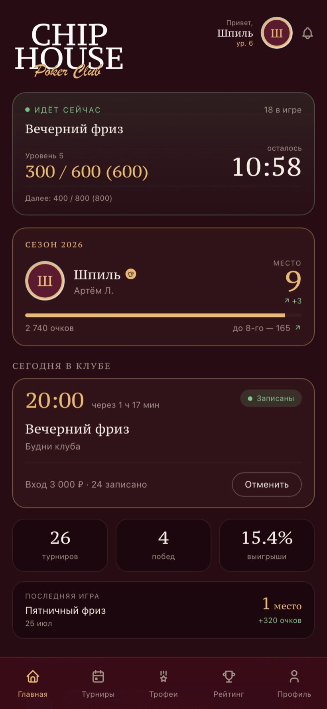
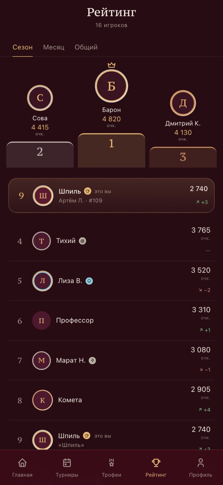

# Chip House Club

> **ПРОФИЛЬ → РЕЙТИНГ → ДОСТИЖЕНИЯ → ЗАПИСЬ НА ТУРНИР**  
> PWA для игроков клуба, работающая на общих данных с CRM.

## Задача

Игроки регулярно уточняли у администратора место в рейтинге, расписание, достижения и условия записи на турнир. Нужно было перенести эти самообслуживаемые сценарии в отдельное приложение, сохранив единую картину данных с клубной CRM.

## Что собрано

| Контур | Решение |
|---|---|
| Профиль игрока | Персональная информация, история и актуальный статус |
| Рейтинг | Место игрока, очки и сравнение с другими участниками сезона |
| Достижения | Трофеи, значки и игровой прогресс |
| Турниры | Расписание и сценарий записи до начала события |
| Мобильный доступ | PWA, которую можно установить на телефон без магазина приложений |

## Инженерные решения

Приложение использует общий контур данных с CRM клуба, но строит отдельный клиентский опыт для игрока. Клиентская навигация, кэширование запросов и адаптивная PWA-оболочка обеспечивают быстрый доступ к часто запрашиваемой информации на мобильном устройстве.

## Стек

`TypeScript` · `React` · `Vite` · `Tailwind CSS` · `React Router` · `TanStack Query` · `PWA`

## Что опубликовано

Этот репозиторий — публичное досье проекта. В нём отсутствуют исходный код, реальные профили игроков, данные турниров и настройки сервера. Скриншоты показывают интерфейс на демонстрационных данных.

[Посмотреть полный кейс на портфолио →](https://artyomliske.github.io/#case-chclub)
